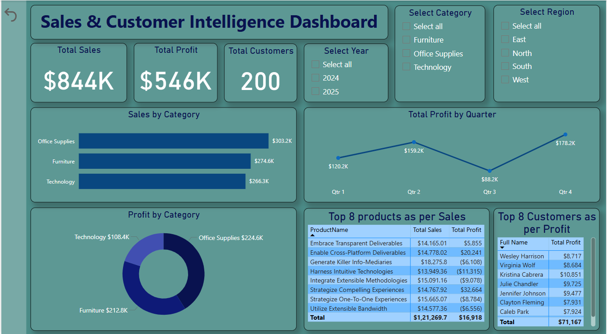

# 🧠 Final Power BI Project - Sales & Customer Intelligence Dashboard

## 📊 Overview

This Power BI dashboard delivers deep, actionable insights into **Sales**, **Returns**, **Customer Behavior**, and **Regional Performance** over the **last three years**. Designed for **senior leadership**, this project supports strategic decision-making using robust data modeling, advanced DAX, and intuitive interactivity.

---
## Screenshot

---

## 🕒 Development Timeline

- **Total Time Spent**: ~40+ hours across multiple stages
  - Data Cleaning & Preparation: 8 hours
  - Data Modeling & Relationship Mapping: 6 hours
  - DAX Calculations (KPIs, Time Intelligence, Ratios): 10 hours
  - Dashboard Design & Visuals: 10 hours
  - Drillthroughs, Mobile View, Testing & Polishing: 6+ hours

---

## 🛠️ Tools & Technologies

- **Power BI Desktop**
- **DAX (Data Analysis Expressions)**
- **Power Query (M Language)**
- **Excel (.xlsx), CSV, and internal data connectors**

---

## 🧱 Data Model Structure

A **star schema** was implemented for optimal performance and simplicity:

### Fact Tables:
- `Sales_Fact`: Includes Quantity, Sales Amount, Discount, Returns, DateKey, ProductKey, CustomerKey, RegionKey

### Dimension Tables:
- `Date`: Full calendar table with Year, Month, Quarter, Week, etc.
- `Customer`: Customer Name, Segment, Region, Loyalty Status
- `Product`: Product Category, Subcategory, Brand, Price
- `Region`: Country, State, City, Region Grouping
- `Returns`: Linked through Sales or separate logic via Return Date and Quantity

> ✅ **Inactive relationships** were carefully handled using USERELATIONSHIP where needed (e.g., for Return Analysis).

---

## 🔍 Key Dashboard Components

### 1. **Executive Summary**
- KPIs: Total Sales, Profit, Returns %, Avg Order Value, Customer Growth
- Year-over-Year (YoY) comparisons
- Slicers: Year, Region, Customer Segment, Product Category

### 2. **Sales Performance**
- Sales Trend by Month/Quarter/Year
- Regional and Product-wise breakdown
- Contribution by top products/customers
- Dynamic tooltips and conditional formatting

### 3. **Customer Behavior**
- New vs Returning Customers
- RFM Analysis (Recency, Frequency, Monetary)
- Segmentation by Loyalty or Activity Level

### 4. **Returns Analysis**
- Return Rate over time
- High return-prone products/regions
- Correlation with Discounts or Delivery Times

### 5. **Regional Intelligence**
- Sales heatmaps
- Region-wise profit margins and growth
- Filtering by geography for localized insights

### 6. **Drillthrough Pages**
- Deep dives into: Customer Profile, Product Details, Region Focus
- Used dynamic headers and back buttons for UX flow

---

## 🔐 Security & Roles

- Role Level Security (RLS) implemented for regional managers
- Region column used to filter access based on user role

---

## 🧠 Advanced DAX Highlights

- `YoY Growth = DIVIDE([Current Year] - [Previous Year], [Previous Year])`
- `Return Rate = DIVIDE(SUM(Returns[ReturnQty]), SUM(Sales[Qty]))`
- Dynamic Titles: `SELECTEDVALUE()` and `ISFILTERED()` logic
- Time Intelligence: `SAMEPERIODLASTYEAR`, `DATESYTD`, `PARALLELPERIOD`

---

## 📝 Learnings & Challenges

- Efficiently managing large datasets with performance-friendly models
- Handling inactive relationships and ambiguous date paths
- Creating user-friendly layouts for both desktop & mobile
- Writing reusable DAX measures and centralizing them in a Measure Table

---

## 📌 Final Thoughts

This project demonstrates a complete **end-to-end BI solution** — from raw data ingestion to executive-ready insights. The dashboard is scalable, intuitive, and tailored for strategic storytelling.
---